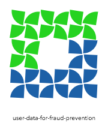

# user-data-for-fraud-prevention

<!-- ALL-CONTRIBUTORS-BADGE:START - Do not remove or modify this section -->

<!-- ALL-CONTRIBUTORS-BADGE:END -->

## Description

This is an npm library to detect some browser or device details of the user such as Timezone, screen sizes, browser configuration etc.
Such details are often required to be sent by software providers to the tax authority in their country to prevent fraud.

Eg: Tax Authority in UK (HMRC) requires software providers using some of their APIs to provide consistent headers known as Fraud Prevention headers. This node module collects such information for you in the format required.

Each top level folder in `src/js` has its own README with more specific information around the use case. E.g. [HMRC README](src/js/hmrc/README.md)

## How to use
Usage instructions can be found [here](./USAGE.md)

## Demo
You can find a demo of the project [here](https://github.com/reubenae/user-data-demo)

## Contributing

We do not allow contributors to claim issues. If you find something interesting you can contribute to the repo, feel free to raise a PR. We do not require you to let us know in advance. 

1. Fork the repo
1. Install dependencies locally `yarn` or `npm install`
1. Make your changes.
1. Make sure it builds `yarn build` or `npm run build`
1. Run the tests (you added tests, right?) with `npm test` or `yarn tests`
1. Test your changes in your consuming code or using our demo project: [`yarn link`](https://classic.yarnpkg.com/en/docs/cli/link) or [`npm link`](https://docs.npmjs.com/cli/link)
1. Ensure the code coverage is the same or higher than before your changes.
1. Create a PR to the `master` branch

## How Contributors can Add Themselves

There are two ways to add yourself as a contributor to this repo:

1. Call @all-contributors bot by adding this following comment in a PR: **@all-contributors please add [username] for [contributions]**. Please refer to the [docs](https://allcontributors.org/docs/en/bot/usage) for more info.
1. Use the all-contributors-cli by running `npx all-contributors add [username] [contributions]`. Please refer to the [docs](https://allcontributors.org/docs/en/cli/usage) for more info.

All parameters are required.
See the [Emoji Key (Contribution Types Reference)](https://allcontributors.org/docs/en/emoji-key) for a list of valid contribution types.

## License

[License](LICENSE)

## Changelog

Please see our [CHANGELOG](CHANGELOG.md)

## Contributors

<!-- ALL-CONTRIBUTORS-LIST:START - Do not remove or modify this section -->
<!-- prettier-ignore-start -->
<!-- markdownlint-disable -->
<table>
  <tr>
    <td align="center"><a href="http://rachelquan.xyz/"> <b>Rachel Quan</b></a> <a href="#tool-rachelquan" title="Tools">🔧</a></td>
  </tr>
</table>

<!-- markdownlint-restore -->
<!-- prettier-ignore-end -->

<!-- ALL-CONTRIBUTORS-LIST:END -->